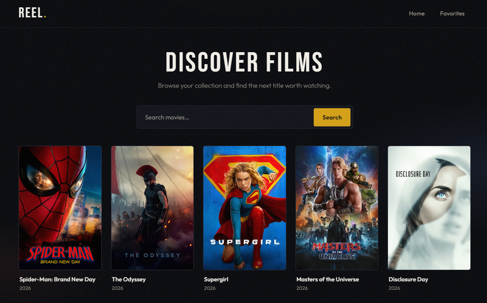
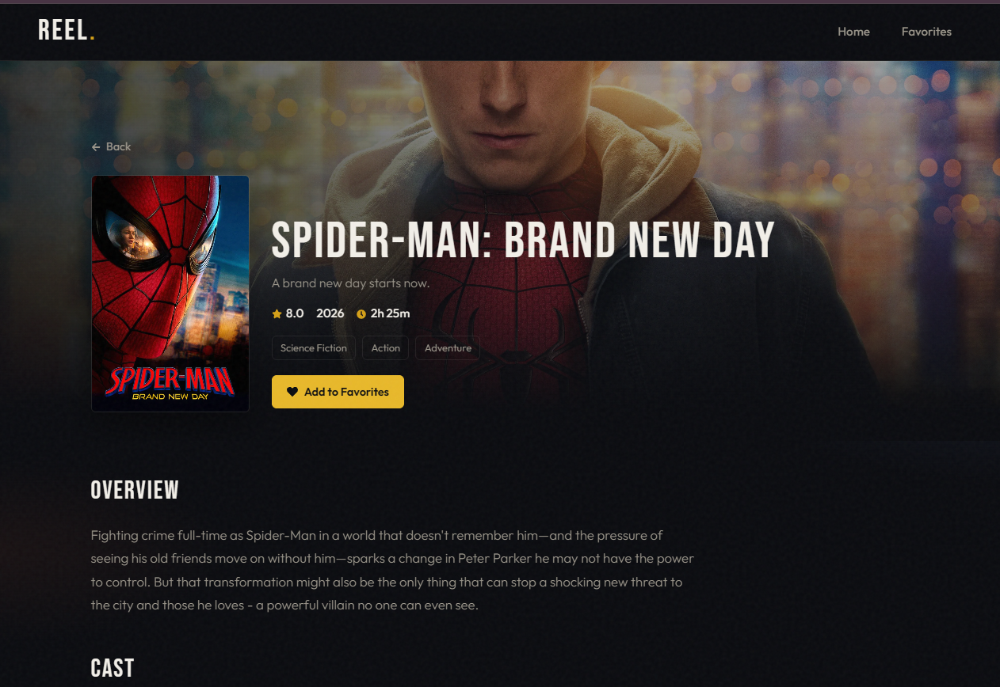
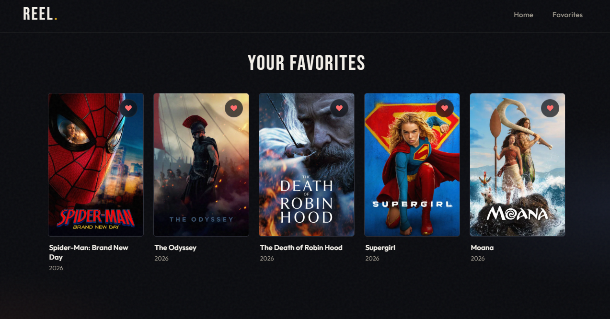

# REEL — Movie App



A React movie browser powered by [The Movie Database (TMDB)](https://www.themoviedb.org/). Browse popular films, search titles, save favorites, and open detailed movie pages with cast and trailers.

## Features



- **Popular movies** — home page loads trending/popular titles from TMDB
- **Search** — find movies by title
- **Favorites** — save/remove favorites (persisted in `localStorage`)
- **Movie details** — overview, rating, runtime, genres, cast (horizontal scroll), and YouTube trailer
- **Cinema UI** — dark theme with gold accents, skeleton loading states



## Tech stack

- React 19 + Vite
- React Router
- React Icons
- TMDB API

## Getting started

```bash
cd frontend
npm install
npm run dev
```

App runs at `http://localhost:5173/`.

### Other scripts

| Command         | Description              |
| --------------- | ------------------------ |
| `npm run dev`   | Start development server |
| `npm run build` | Production build         |
| `npm run preview` | Preview production build |
| `npm run lint`  | Run ESLint               |

### TMDB API key

Movie data comes from TMDB. Get a free API key at [themoviedb.org/settings/api](https://www.themoviedb.org/settings/api), then set it in `src/services/api.js`:

```js
const API_KEY = "your_tmdb_api_key";
```

## Routes

| Path           | Page                          |
| -------------- | ----------------------------- |
| `/`            | Home — popular movies + search |
| `/favorites`   | Saved favorites               |
| `/movie/:id`   | Movie details                 |

## Project structure

```
frontend/src/
├── components/
│   ├── MovieCard.jsx
│   ├── NavBar.jsx
│   └── movie-details/
│       ├── MovieHero.jsx
│       ├── MovieOverview.jsx
│       ├── MovieCast.jsx
│       └── MovieTrailer.jsx
├── contexts/
│   └── MovieContext.jsx      # favorites state + localStorage
├── pages/
│   ├── Home.jsx
│   ├── Favorites.jsx
│   └── MovieDetails.jsx
├── services/
│   └── api.js                # TMDB API helpers
└── css/                      # page & component styles
```

## License

Personal / learning project. Movie data and images © TMDB and respective owners.
